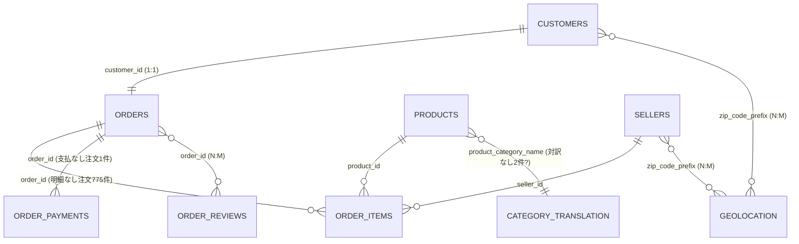

# Olist データプロファイリング結果

> 対象: Kaggle "Brazilian E-Commerce Public Dataset by Olist"(CSV 10ファイル)
> 調査方法: DuckDB CLI によるロード前構造調査(行数 → DESCRIBE → キー一意性 → テーブル間関係)
> 実施: 2026-07 / ブランチ: feature/2-load-olist-raw
> 目的: ①Snowflake RAWスキーマへのロード時の COUNT(*) 突合期待値の確保 ②Week 2 ビジネスキー設計(Hub/Link/Satellite)の根拠資料

---

## 全体サマリ

| テーブル | 行数 | 粒度(1行=) | 主キー |
|---|---:|---|---|
| olist_customers_dataset | 99,441 | 注文に紐づく顧客レコード(顧客そのものではない) | customer_id |
| olist_orders_dataset | 99,441 | 1注文 | order_id |
| olist_order_items_dataset | 112,650 | 注文明細行 | (order_id, order_item_id) 複合 |
| olist_order_payments_dataset | 103,886 | 注文内の支払レコード | (order_id, payment_sequential) 複合(推定・未検証) |
| olist_order_reviews_dataset | 99,224 | レビュー×注文の組 | (review_id, order_id) 複合(検証済) |
| olist_products_dataset | 32,951 | 1商品 | product_id |
| olist_sellers_dataset | 3,095 | 1販売者 | seller_id |
| olist_geolocation_dataset | 1,000,163 | 郵便番号prefix単位の位置情報サンプル | 単独・複合とも主キーなし |
| product_category_name_translation | 71 | カテゴリ名の葡→英対訳 | product_category_name |

---

## テーブル別詳細

### olist_customers_dataset.csv

- **粒度**: 1行 = 1注文に紐づく顧客レコード(customer_id は注文ごとに発番される)
- **主キー**: customer_id(99,441 / 99,441 一意)
- **関係**: orders.customer_id と 1:1。customer_unique_id が実在人物を表す(96,096人 / 99,441レコード、重複3,345)

| No | 項目名 | データ型 | total_rows | distinct | duplicates | min | max | null% |
|---|---|---|---:|---:|---:|---|---|---:|
| 1 | customer_id | VARCHAR | 99441 | 99441 | 0 | 00012a2ce6f8dcda20d059ce98491703 | ffffe8b65bbe3087b653a978c870db99 | 0.00% |
| 2 | customer_unique_id | VARCHAR | 99441 | 96096 | 3345 | 0000366f3b9a7992bf8c76cfdf3221e2 | ffffd2657e2aad2907e67c3e9daecbeb | 0.00% |
| 3 | customer_zip_code_prefix | VARCHAR | 99441 | 14994 | 84447 | 1003 | 99990 | 0.00% |
| 4 | customer_city | VARCHAR | 99441 | 4119 | 95322 | abadia dos dourados | zortea | 0.00% |
| 5 | customer_state | VARCHAR | 99441 | 27 | 99414 | AC | TO | 0.00% |

**DV2.0メモ**: ビジネス上の「顧客」を一意に表すのは customer_unique_id(hub_customer のBK本命)。物理結合キーの customer_id をどう扱うかは Week 2 の設計論点(→ 保留リスト)。

### olist_orders_dataset.csv

- **粒度**: 1行 = 1注文
- **主キー**: order_id(99,441 / 99,441 一意)
- **関係**: customers と customer_id で 1:1(distinct 99,441 で完全一致を確認済)

| No | 項目名 | データ型 | total_rows | distinct | duplicates | min | max | null% |
|---|---|---|---:|---:|---:|---|---|---:|
| 1 | order_id | VARCHAR | 99441 | 99441 | 0 | 00010242fe8c5a6d1ba2dd792cb16214 | fffe41c64501cc87c801fd61db3f6244 | 0.00% |
| 2 | customer_id | VARCHAR | 99441 | 99441 | 0 | 00012a2ce6f8dcda20d059ce98491703 | ffffe8b65bbe3087b653a978c870db99 | 0.00% |
| 3 | order_status | VARCHAR | 99441 | 8 | 99433 | approved | unavailable | 0.00% |
| 4 | order_purchase_timestamp | TIMESTAMP | 99441 | 98875 | 566 | 2016-09-04 21:15:19 | 2018-10-17 17:30:18 | 0.00% |
| 5 | order_approved_at | TIMESTAMP | 99441 | 90733 | 8708 | 2016-09-15 12:16:38 | 2018-09-03 17:40:06 | 1.60% |
| 6 | order_delivered_carrier_date | TIMESTAMP | 99441 | 81018 | 18423 | 2016-10-08 10:34:01 | 2018-09-11 19:48:28 | 1.79% |
| 7 | order_delivered_customer_date | TIMESTAMP | 99441 | 95664 | 3777 | 2016-10-11 13:46:32 | 2018-10-17 13:22:46 | 2.98% |
| 8 | order_estimated_delivery_date | TIMESTAMP | 99441 | 459 | 98982 | 2016-09-30 00:00:00 | 2018-11-12 00:00:00 | 0.00% |

**メモ**: 配送系タイムスタンプのNULLはステータス起因(未出荷・未配達)の可能性が高い。order_status 別のNULL分布確認は Week 2 に持ち越し。

### olist_order_items_dataset.csv

- **粒度**: 1行 = 注文明細行(注文×商品×販売者)
- **主キー**: (order_id, order_item_id) 複合。order_item_id は注文内連番(1〜21)
- **関係**: orders(N:1)、products(N:1)、sellers(N:1)。明細を持つ注文は 98,666 / 99,441 → **明細レコードのない注文が775件存在**

| No | 項目名 | データ型 | total_rows | distinct | duplicates | min | max | null% |
|---|---|---|---:|---:|---:|---|---|---:|
| 1 | order_id | VARCHAR | 112650 | 98666 | 13984 | 00010242fe8c5a6d1ba2dd792cb16214 | fffe41c64501cc87c801fd61db3f6244 | 0.00% |
| 2 | order_item_id | BIGINT | 112650 | 21 | 112629 | 1 | 21 | 0.00% |
| 3 | product_id | VARCHAR | 112650 | 32951 | 79699 | 00066f42aeeb9f3007548bb9d3f33c38 | fffe9eeff12fcbd74a2f2b007dde0c58 | 0.00% |
| 4 | seller_id | VARCHAR | 112650 | 3095 | 109555 | 0015a82c2db000af6aaaf3ae2ecb0532 | ffff564a4f9085cd26170f4732393726 | 0.00% |
| 5 | shipping_limit_date | TIMESTAMP | 112650 | 93318 | 19332 | 2016-09-19 00:15:34 | 2020-04-09 22:35:08 | 0.00% |
| 6 | price | DOUBLE | 112650 | 5968 | 106682 | 0.85 | 6735.0 | 0.00% |
| 7 | freight_value | DOUBLE | 112650 | 6999 | 105651 | 0 | 409.68 | 0.00% |

**DV2.0メモ**: order-product-seller を繋ぐLink設計の中心テーブル。明細なし注文775件の status 内訳確認は Week 2 に持ち越し。

### olist_order_payments_dataset.csv

- **粒度**: 1行 = 注文内の支払レコード(分割・複数手段で1注文に複数行)
- **主キー**: (order_id, payment_sequential) 複合と推定(一意性未検証 → ロード後にSnowflakeで検証)
- **関係**: orders(N:1)。支払を持つ注文は 99,440 / 99,441

| No | 項目名 | データ型 | total_rows | distinct | duplicates | min | max | null% |
|---|---|---|---:|---:|---:|---|---|---:|
| 1 | order_id | VARCHAR | 103886 | 99440 | 4446 | 00010242fe8c5a6d1ba2dd792cb16214 | fffe41c64501cc87c801fd61db3f6244 | 0.00% |
| 2 | payment_sequential | BIGINT | 103886 | 29 | 103857 | 1 | 29 | 0.00% |
| 3 | payment_type | VARCHAR | 103886 | 5 | 103881 | boleto | voucher | 0.00% |
| 4 | payment_installments | BIGINT | 103886 | 24 | 103862 | 0 | 24 | 0.00% |
| 5 | payment_value | DOUBLE | 103886 | 29077 | 74809 | 0.0 | 13664.08 | 0.00% |

**データ品質異常(検証済)**: 支払レコードを持たない注文が1件のみ存在。
`order_id = bfbd0f9bdef84302105ad712db648a6c`、order_status = **delivered**(配達完了なのに支払記録なし=ステータスで説明できない欠損)。Link構築時の「片側にしか存在しないキー」の実例として扱う。

### olist_order_reviews_dataset.csv

- **粒度**: 1行 = レビュー×注文の組
- **主キー**: (review_id, order_id) 複合(99,224 / 99,224 で一意性**検証済**)。review_id 単独(重複814)、order_id 単独(重複551)はいずれも主キーにならない
- **関係**: orders(N:M — 1レビューが複数注文に紐づくケースと1注文に複数レビューのケースが混在)。レビューを持つ注文は 98,673 / 99,441

| No | 項目名 | データ型 | total_rows | distinct | duplicates | min | max | null% |
|---|---|---|---:|---:|---:|---|---|---:|
| 1 | review_id | VARCHAR | 99224 | 98410 | 814 | 0001239bc1de2e33cb583967c2ca4c67 | fffefe7a48d22f7b32046421062219d1 | 0.00% |
| 2 | order_id | VARCHAR | 99224 | 98673 | 551 | 00010242fe8c5a6d1ba2dd792cb16214 | fffe41c64501cc87c801fd61db3f6244 | 0.00% |
| 3 | review_score | BIGINT | 99224 | 5 | 99219 | 1 | 5 | 0.00% |
| 4 | review_comment_title | VARCHAR | 99224 | 4527 | 94697 | (空) | 🔟 | 88.34% |
| 5 | review_comment_message | VARCHAR | 99224 | 36159 | 63065 | (空) | 😡😡…(絵文字含む自由記述) | 58.70% |
| 6 | review_creation_date | TIMESTAMP | 99224 | 636 | 98588 | 2016-10-02 00:00:00 | 2018-08-31 00:00:00 | 0.00% |
| 7 | review_answer_timestamp | TIMESTAMP | 99224 | 98248 | 976 | 2016-10-07 18:32:28 | 2018-10-29 12:27:35 | 0.00% |

**ロード注意(最重要)**: コメント列に絵文字(UTF-8多バイト)・カンマ・引用符・改行を含む自由記述あり。COPY INTO のファイルフォーマット設定(FIELD_OPTIONALLY_ENCLOSED_BY 等)を要調整。行数突合が最もズレやすいテーブル。
**DV2.0メモ**: review_id が単独で一意でないため、hub_review のBK設計は要議論(Week 2)。

### olist_products_dataset.csv

- **粒度**: 1行 = 1商品
- **主キー**: product_id(32,951 / 32,951 一意)
- **関係**: order_items(1:N)、category_translation(N:1)

| No | 項目名 | データ型 | total_rows | distinct | duplicates | min | max | null% |
|---|---|---|---:|---:|---:|---|---|---:|
| 1 | product_id | VARCHAR | 32951 | 32951 | 0 | 00066f42aeeb9f3007548bb9d3f33c38 | fffe9eeff12fcbd74a2f2b007dde0c58 | 0.00% |
| 2 | product_category_name | VARCHAR | 32951 | 73 | 32878 | agro_industria_e_comercio | utilidades_domesticas | 1.85% |
| 3 | product_name_lenght | BIGINT | 32951 | 66 | 32885 | 5 | 76 | 1.85% |
| 4 | product_description_lenght | BIGINT | 32951 | 2960 | 29991 | 4 | 3992 | 1.85% |
| 5 | product_photos_qty | BIGINT | 32951 | 19 | 32932 | 1 | 20 | 1.85% |
| 6 | product_weight_g | BIGINT | 32951 | 2204 | 30747 | 0 | 40425 | 0.01% |
| 7 | product_length_cm | BIGINT | 32951 | 99 | 32852 | 7 | 105 | 0.01% |
| 8 | product_height_cm | BIGINT | 32951 | 102 | 32849 | 2 | 105 | 0.01% |
| 9 | product_width_cm | BIGINT | 32951 | 73(注) | — | 6 | 118 | 0.01% |

(注) width の distinct は元調査で95。転記時に確認のこと。

- カテゴリ関連4列(category_name / name_lenght / description_lenght / photos_qty)が揃って1.85%欠損 → 同一行群でまとめて欠けている可能性が高い(カテゴリ未登録商品)。物理系4列の欠損(0.01%)とは別グループ
- distinct 73 に対し対訳テーブルは71行 → **対訳のないカテゴリが2つ存在する可能性**(要確認・Week 2)
- 列名の綴り(lenght)はソース由来のtypo。リネームはstaging層の設計論点

### olist_sellers_dataset.csv

- **粒度**: 1行 = 1販売者
- **主キー**: seller_id(3,095 / 3,095 一意)
- **関係**: order_items(1:N)

| No | 項目名 | データ型 | total_rows | distinct | duplicates | min | max | null% |
|---|---|---|---:|---:|---:|---|---|---:|
| 1 | seller_id | VARCHAR | 3095 | 3095 | 0 | 0015a82c2db000af6aaaf3ae2ecb0532 | ffff564a4f9085cd26170f4732393726 | 0.00% |
| 2 | seller_zip_code_prefix | VARCHAR | 3095 | 2246 | 849 | 01001 | 99730 | 0.00% |
| 3 | seller_city | VARCHAR | 3095 | 611 | 2484 | 04482255 | xaxim | 0.00% |
| 4 | seller_state | VARCHAR | 3095 | 23 | 3072 | AC | SP | 0.00% |

**メモ**: seller_city の min が `04482255`(数値=明らかなゴミ値)。city列の品質は低い前提で扱う。

### olist_geolocation_dataset.csv

- **粒度**: 1行 = 郵便番号prefix単位の位置情報サンプル(同一zipに多数の座標)
- **主キー**: なし(単独列・自明な複合とも一意にならない)
- **関係**: customers / sellers と zip_code_prefix で N:M

| No | 項目名 | データ型 | total_rows | distinct | duplicates | min | max | null% |
|---|---|---|---:|---:|---:|---|---|---:|
| 1 | geolocation_zip_code_prefix | VARCHAR | 1000163 | 19015 | 981148 | 01001 | 99990 | 0.00% |
| 2 | geolocation_lat | DOUBLE | 1000163 | 717372 | 282791 | -36.6053744107061 | 45.06593318269697 | 0.00% |
| 3 | geolocation_lng | DOUBLE | 1000163 | 717615 | 282548 | -101.46676644931476 | 121.10539381057764 | 0.00% |
| 4 | geolocation_city | VARCHAR | 1000163 | 8011 | 992152 | * cidade | óleo | 0.00% |
| 5 | geolocation_state | VARCHAR | 1000163 | 27 | 1000136 | AC | TO | 0.00% |

**メモ**: 品質が最も低いテーブル。city にゴミ値(`* cidade`)、座標にブラジル国外の外れ値(lng=121等)。RAWへはそのままロードするが、**Raw Vaultに含めるか・含めるならBKは何かは保留**(→ design_decisions.md 保留リスト)。

### product_category_name_translation.csv

- **粒度**: 1行 = カテゴリ名の葡→英対訳
- **主キー**: product_category_name(71 / 71 一意)
- **関係**: products.product_category_name と 1:N(ただし products 側 distinct 73 > 対訳 71)

| No | 項目名 | データ型 | total_rows | distinct | duplicates | min | max | null% |
|---|---|---|---:|---:|---:|---|---|---:|
| 1 | product_category_name | VARCHAR | 71 | 71 | 0 | agro_industria_e_comercio | utilidades_domesticas | 0.00% |
| 2 | product_category_name_english | VARCHAR | 71 | 71 | 0 | agro_industry_and_commerce | watches_gifts | 0.00% |

**メモ**: 小規模な参照マスタだが、他9テーブルとロード手順を統一するため COPY INTO でロードする(seedsは使わない)。

---

## テーブル間関係(ER図下書き)

---

## COUNT(*) 突合用 期待値一覧

| ファイル | 期待行数 |
|---|---:|
| olist_customers_dataset.csv | 99,441 |
| olist_orders_dataset.csv | 99,441 |
| olist_order_items_dataset.csv | 112,650 |
| olist_order_payments_dataset.csv | 103,886 |
| olist_order_reviews_dataset.csv | 99,224 |
| olist_products_dataset.csv | 32,951 |
| olist_sellers_dataset.csv | 3,095 |
| olist_geolocation_dataset.csv | 1,000,163 |
| product_category_name_translation.csv | 71 |

---

## Week 2 への持ち越し論点

1. hub_customer: BK = customer_unique_id(本命)。物理結合キー customer_id の扱い(捨てる/Hub/Link構成要素)
2. hub_review: review_id が単独一意でない前提でのBK設計
3. order_items を軸にした Link の切り方(order-product-seller の3方向か、分割か)
4. geolocation を Raw Vault に含めるか
5. 明細なし注文775件 / 支払なし注文1件(delivered)の status 内訳・扱い
6. products のカテゴリ73 vs 対訳71 の差分特定
7. 配送系タイムスタンプNULLの order_status 別分布
